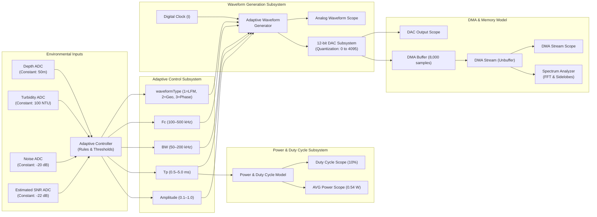
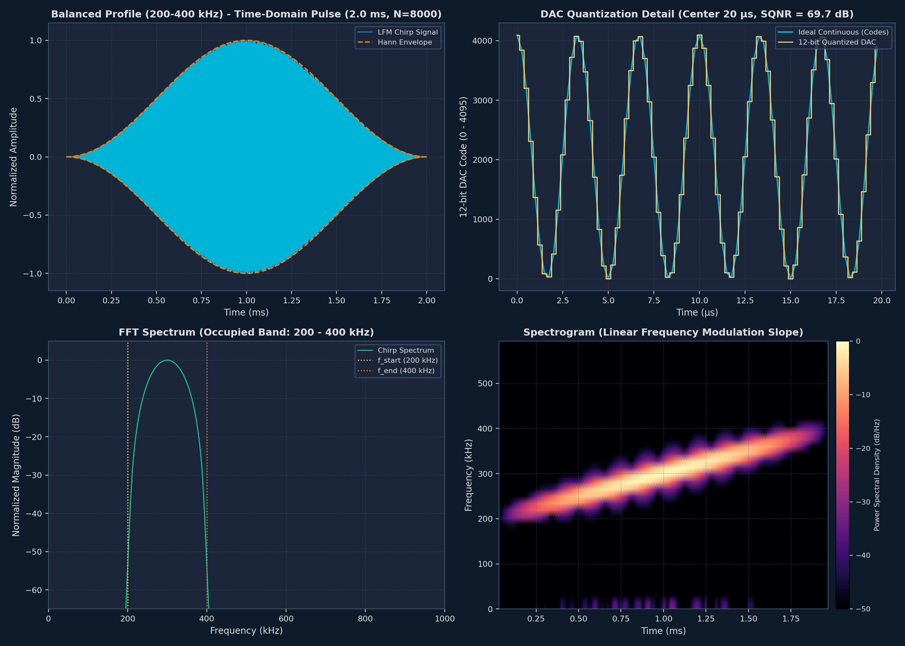
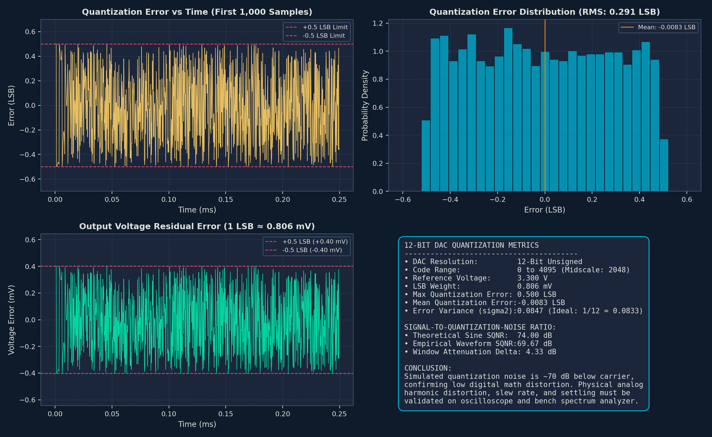
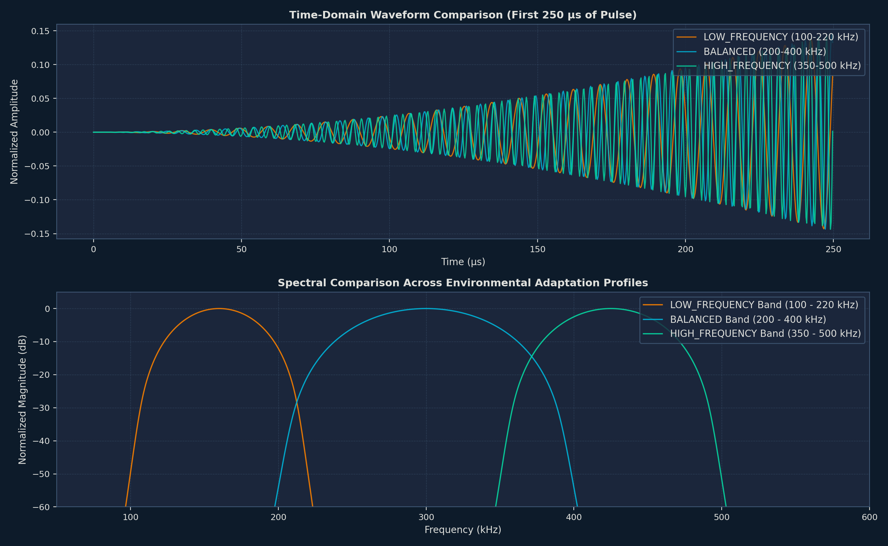
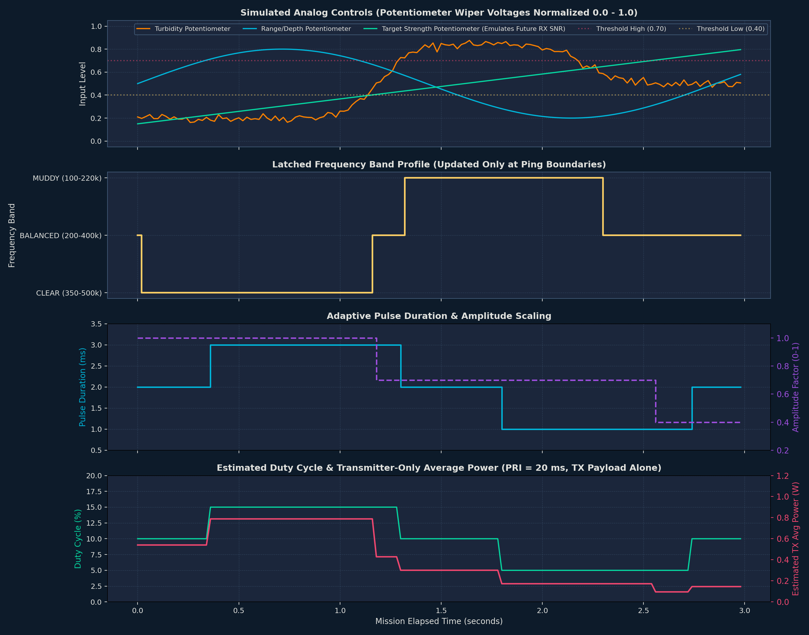

# SonarX — AUV Adaptive Sonar Transmitter Digital Twin

> **SonarX — AUV Adaptive Sonar Transmitter Digital Twin**  
> *Smart India Hackathon (SIH) — Problem Statement 26058*  
>
> [](#7-matlab--simulink-implementation) &nbsp; [](#4-system-architecture) &nbsp; [](#11-simulation--demo)

---


-success?logo=pytest&logoColor=white)
-brightgreen)


**SonarX** is an engineering-grade digital twin simulator, cross-platform algorithmic validation framework, and compile-ready bare-metal embedded firmware prototype for the transmitter payload of a low-power, real-time adaptive software-defined sonar designed for Autonomous Underwater Vehicles (AUVs), implementing **Smart India Hackathon (SIH) Problem Statement 26058**.

---

## Table of Contents
1. [Problem Statement (SIH PS 26058)](#1-problem-statement)
2. [Our Solution](#2-our-solution)
3. [Truth-in-Engineering & Scope Boundaries](#3-truth-in-engineering--scope-boundaries)
4. [System Architecture](#4-system-architecture)
5. [Technical Approach](#5-technical-approach)
   - [Underwater Acoustic Modeling](#underwater-acoustic-modeling)
   - [Ainslie–McColm Absorption](#ainsliemccolm-absorption)
   - [Transmission Loss & Relative Propagation Margin](#transmission-loss--relative-propagation-margin)
   - [Canonical Sonar Operating Profiles](#canonical-sonar-operating-profiles)
   - [Profile Performance Evaluation Engine](#profile-performance-evaluation-engine)
   - [Adaptive Selection Hierarchy](#adaptive-selection-hierarchy)
   - [Hysteresis & Decision Stabilization](#hysteresis--decision-stabilization)
   - [Waveform Generation & DAC Quantization](#waveform-generation--dac-quantization)
6. [End-to-End Pipeline (13 Stages)](#6-end-to-end-pipeline)
7. [MATLAB / Simulink Implementation](#7-matlab--simulink-implementation)
   - [Simulink Dynamic Model (`adaptive_sonar_system.slx`)](#simulink-dynamic-model-adaptive_sonar_systemslx)
   - [MATLAB Digital Twin Script Suite](#matlab-digital-twin-script-suite)
   - [Interactive Dashboard & Multi-Waveform Analysis](#interactive-dashboard--multi-waveform-analysis)
8. [Python Implementation](#8-python-implementation)
   - [Module Architecture](#module-architecture)
   - [Automated Verification Suite (79 Tests)](#automated-verification-suite-79-tests)
   - [Cross-Platform Parity with MATLAB & C Headers](#cross-platform-parity-with-matlab--c-headers)
9. [Hardware / Embedded Target (STM32G474RET6)](#9-hardware--embedded-target-stm32g474ret6)
   - [Target Hardware Architecture](#target-hardware-architecture)
   - [Feasibility Audit Key Findings & Register Routing](#feasibility-audit-key-findings--register-routing)
   - [Transmitter Duty-Cycle Power Model](#transmitter-duty-cycle-power-model)
10. [Results & Output Analysis](#10-results--output-analysis)
    - [Python Digital Twin Signal Validation Plots](#python-digital-twin-signal-validation-plots)
    - [MATLAB Digital Twin Engineering Figure Catalog](#matlab-digital-twin-engineering-figure-catalog)
    - [Canonical Baseline Metrics & Extinction Boundaries](#canonical-baseline-metrics--extinction-boundaries)
11. [Simulation & Demonstration Runbook](#11-simulation--demonstration-runbook)
    - [Python Environment & Tests](#python-environment--tests)
    - [MATLAB & Simulink Environment](#matlab--simulink-environment)
    - [Embedded Firmware Host Build](#embedded-firmware-host-build)
12. [Hardware Bring-Up & Future Roadmap](#12-hardware-bring-up--future-roadmap)

---

## 1. Problem Statement

### SIH Problem Statement 26058: AUV Adaptive Sonar Transmitter Digital Twin
Autonomous Underwater Vehicles (AUVs) deployed for hydrographic survey, subsea infrastructure inspection, seabed mapping, and obstacle avoidance operate in dynamically shifting oceanographic environments. Conventional subsea sonars operate with static transmit parameters: a single center frequency, fixed pulse duration, fixed bandwidth, and constant output power. 

This fixed-frequency paradigm imposes a severe operational trade-off:
- **Low-Frequency Sonars (<200 kHz):** Experience lower seawater acoustic absorption and can penetrate deeper ranges or operate in turbid waters, but suffer from coarse range resolution ($\Delta R = c / 2B > 6\text{ mm}$) and broad beam divergence angles.
- **High-Frequency Sonars (>350 kHz):** Deliver millimeter-level range resolution and sharp beam directivity, but undergo severe exponential acoustic absorption (over $135\text{ dB/km}$ in warm saline water), leading to premature echo loss at ranges beyond 100–150 meters.

### Why Adaptive Transmission is Essential for AUVs
1. **Dynamic Seawater Attenuation:** Ocean acoustic absorption depends non-linearly on frequency, temperature, salinity, hydrostatic depth pressure, and pH due to chemical relaxation of Boric Acid ($\text{B(OH)}_3$) and Magnesium Sulfate ($\text{MgSO}_4$). As an AUV traverses thermoclines or changes operating depths, the acoustic channel changes drastically.
2. **Conflicting Mission Objectives:** An AUV surveying a broad seabed requires maximum range resolution (wide bandwidth) to distinguish subtle terrain features, whereas obstacle avoidance or pipeline tracking requires high angular directivity (narrow beamwidth).
3. **Severe Energy Constraints:** Subsea vehicles run on finite onboard batteries. Continuous full-power transmission wastes precious Watt-hours; matching transmit pulse duration, duty cycle, and amplitude to the required acoustic range extends survey duration.

### What the Digital Twin Models & Optimizes
The **SonarX Digital Twin** models the complete pre-silicon transmitter pipeline:
- Ingests environmental scenario parameters (range, depth, temperature, salinity, pH, turbidity, ambient noise).
- Computes physical sound speed (Mackenzie 9-term equation) and frequency-dependent absorption (Ainslie–McColm model).
- Evaluates candidate transmission profiles against propagation viability and mission objectives.
- Stabilizes profile selection using directional Schmitt-trigger hysteresis and multi-ping debounce filtering.
- Synthesizes exact phase-continuous Linear Frequency Modulated (LFM) chirps with symmetric Hann window tapering.
- Simulates 12-bit Digital-to-Analog Converter (DAC) quantization at 4.0 MSPS.
- Prepares DMA-ready lookup tables and compiles bare-metal C11 firmware for the STMicroelectronics STM32G474RET6 microcontroller.
- Analytically models duty-cycle power consumption and battery endurance.

---

## 2. Our Solution

SonarX bridges the gap between theoretical ocean acoustic physics, high-level simulation, and embedded hardware implementation through a continuous digital twin architecture:

```text
  [Sensing / Environment Input]
                │
                ▼
  [Acoustic Propagation Modeling]  (Mackenzie Sound Speed & Ainslie-McColm Absorption)
                │
                ▼
  [Profile Performance Evaluation] (5-Point Mean Absorption, Transmission Loss, Margin, Resolution, Directivity)
                │
                ▼
  [Adaptive Profile Selection]     (Two-Tier: Propagation Viability Filter + Mission Utility Selector)
                │
                ▼
  [Hysteresis & Stabilization]    (±5% Schmitt-Trigger Deadbands, N=2 Debounce, Ping-Boundary Latch)
                │
                ▼
  [Waveform Synthesis & DSP]       (Phase Integration, Hann Window Tapering, 12-Bit DAC Quantization)
                │
                ▼
  [Embedded / Hardware Interface]  (DMA Flash Tables, 160 MHz TIM2 TRGO, DAC3 + OPAMP3 Follower to PB1)
```

### Stage Responsibilities:
1. **Sensing / Environment Input:** Ingests water column parameters ($T, S, D, \text{pH}$) and mission distance/quality metrics. In the v1 lab bench setup, these inputs are emulated via precision potentiometers on STM32 12-bit ADC channels.
2. **Acoustic Propagation Modeling:** Evaluates real oceanographic equations (Mackenzie 1981, Ainslie & McColm 1998) without crude linear approximations.
3. **Profile Performance Evaluation:** Computes 5-point discrete frequency absorption across wide chirp sweep bands, spherical spreading transmission loss, ideal range resolution, and relative theoretical directivity.
4. **Adaptive Profile Selection:** Decoupled two-tier decision logic prevents low-frequency bias by evaluating physical viability first, then applying mission utility (e.g. Survey resolution vs. Target directivity).
5. **Hysteresis & Stabilization:** Prevents profile fluttering under noisy sensor readings using directional deadbands, a 2-ping persistence filter, and atomic profile latching synchronized strictly to ping repetition boundaries.
6. **Waveform Synthesis & DSP:** Generates 8,000-sample discrete pulses at 4.0 MSPS with continuous phase integration, Hann window spectral sidelobe suppression (>50 dB), and 12-bit DAC quantization (~69.7 dB SQNR).
7. **Embedded / Hardware Interface:** Precomputes bit-exact C99 headers (`outputs/headers/`) loaded into STM32G474 Flash, streaming out via DMA1 to internal DAC3 Channel 2 and OPAMP3 follower to physical pin PB1.

---

## 3. Truth-in-Engineering & Scope Boundaries

> [!IMPORTANT]
> **Engineering Scope & Model Limitations (Single Source of Truth):**
> SonarX models and validates the **transmitter payload pipeline**: waveform synthesis $\to$ 12-bit DAC quantization $\to$ DMA memory mapping $\to$ frequency-dependent attenuation $\to$ propagation viability filtering $\to$ mission objective profile selection $\to$ directional hysteresis & debounce $\to$ atomic ping-boundary latching $\to$ duty-cycle power dissipation.

```text
================================================================================
SIMULATION STATUS:
Simulation correctness level: algorithmically credible, physically unverified.
================================================================================
```

### What This Project Validates:
1. **Algorithmic Correctness:** Bit-exact phase integration, continuous frequency modulation, and Hann windowing across all three canonical profiles.
2. **DAC Quantization & Signal Fidelity:** 12-bit unsigned DAC model at 4.0 MSPS achieving ~69.67 dB simulated SQNR, with quantization residuals bounded strictly in $[-0.5, +0.5]\text{ LSB}$ ($\pm 0.403\text{ mV}$ on 3.3V reference).
3. **Microcontroller Memory Footprint:** 8,000 samples per pulse requiring exactly 16.0 KB as `uint16_t` (12.5% of STM32G474 128 KB SRAM; 48.0 KB total for all 3 profile LUTs in Flash, or 9.37% of 512 KB Flash).
4. **Decoupled Selection & State Machine Stability:** Directional Schmitt-trigger hysteresis and $N=2$ debounce reject simulated analog sensor noise ($\sigma = 0.02$) with zero state fluttering.
5. **Ping-Boundary Synchronization:** Atomic profile updates latched during the 18.0 ms quiet gap (DMA Transfer-Complete ISR), preventing mid-pulse phase jumps.
6. **Transmitter Power Throttling:** Analytical $10.0\%$ duty-cycle average electrical power dissipation of $0.540\text{ W}$ at 12V ($45.0\text{ mA}$ average current).

### What This Project Explicitly Does NOT Claim or Validate:
- **Transducer Electromechanics:** Does not model piezoelectric ceramic resonance, electromechanical coupling ($k_t$), or Butterworth-Van Dyke (BVD) electrical impedance matching.
- **Physical Ocean Acoustic Field Measurements:** Does not claim sea trials or field acoustic echo measurements.
- **Receiver / Hydrophone Processing:** This repository implements the **transmitter payload pipeline only**. Receiver front-ends, match filtering, and physical echo SNR measurements are out of scope (emulated via target strength input in v1).
- **Analog Power Amplifier Settling:** Analog slew rates, crossover distortion, and PA thermal stability must be verified during physical bench bring-up.
- **Vehicle-Level Endurance:** The 183.2-hour metric applies to the **transmitter payload electrical load alone** on a 99 Wh pack; complete AUV mission life is heavily dominated by thrusters (50–200 W), navigation computers (10–30 W), INS/DVL, and comms.

---

## 4. System Architecture

The following diagram illustrates the complete software, algorithmic, and embedded data flow implemented across the repository:

```mermaid
flowchart TD
    subgraph SENSING ["1. Environmental Sensing & Scenario Input"]
        E1["Range R (m)"] --> PARSE["Environmental Scenario Engine\n(src/profile_evaluator.py\nmatlab/channel_model.m)"]
        E2["Depth D (m)"] --> PARSE
        E3["Temp T (°C), Salinity S (PSU), pH"] --> PARSE
        E4["Turbidity (NTU), Ambient Noise (dB)"] --> PARSE
        POT["v1 Bench Potentiometers\n(STM32 12-bit ADC Channels)"] -.-> PARSE
    end

    subgraph ACOUSTIC_PROPAGATION ["2. Acoustic Physics & Propagation Engine"]
        PARSE --> SPEED["Mackenzie (1981) Sound Speed:\nc(T, S, D) ∈ [1400, 1600] m/s"]
        PARSE --> ABSORB["Ainslie-McColm (1998) 5-Point Absorption:\nBoric Acid + MgSO4 (P2 depth) + Pure Water"]
        SPEED --> TL["Transmission Loss:\nTL(R) = 20 log10(R) + α_bar · (R/1000)"]
        ABSORB --> TL
        TL --> MARGIN["Relative Propagation Margin:\nM_rel = SL_rel - TL(R) - NP_sim"]
    end

    subgraph SELECTION_ENGINE ["3. Two-Tier Profile Evaluation & Selection"]
        MARGIN --> TIER1{"Tier 1: Propagation Viability\nIs M_rel ≥ Thresh_viab (-65.0 dB)?"}
        TIER1 -- "Fail (< -65 dB)" --> FAILSAFE["Fail-Safe Fallback:\nSelect LOW_FREQUENCY (100–220 kHz)\n(Lowest Attenuation: 63.99 dB/km)"]
        TIER1 -- "Viable (≥ -65 dB)" --> TIER2["Tier 2: Mission Objective Selector"]
        TIER2 -- "SURVEY MODE" --> BAL["Select BALANCED (200–400 kHz)\n(Finest Resolution: ΔR = 3.75 mm)"]
        TIER2 -- "DIRECTIVITY MODE" --> HIGH["Select HIGH_FREQUENCY (350–500 kHz)\n(Narrowest Beam: 1.417x Directivity)"]
        BAL --> CANDIDATE["Raw Candidate Profile ID"]
        HIGH --> CANDIDATE
        FAILSAFE --> CANDIDATE
    end

    subgraph STATE_MACHINE ["4. Hysteresis, Debounce & Ping Latching"]
        CANDIDATE --> HYST["Directional Schmitt-Trigger Hysteresis\n(±5% Deadbands: 0.40/0.30 & 0.70/0.60)"]
        HYST --> DEBOUNCE["Debounce Persistence Filter\n(N = 2 Consecutive Pings Required)"]
        DEBOUNCE --> PENDING["Pending Profile Register"]
        PENDING --> LATCH{"Ping Repetition Boundary\n(PRI = 20.0 ms / 50 Hz Interrupt)"}
        LATCH --> ACTIVE["Committed Active Profile\n(Zero Mid-Pulse Phase Discontinuity)"]
    end

    subgraph DSP_SYNTHESIS ["5. DSP Waveform Synthesis & DAC Quantization"]
        ACTIVE --> PARAMS["Profile Parameters:\nf_start, f_stop, k, Tp=2.0ms, Fs=4MSPS, A"]
        PARAMS --> PHASE["Continuous Phase Integration:\nφ(t) = 2π(f_start·t + 0.5·k·t²)"]
        PHASE --> HANN["Symmetric Hann Window Tapering:\nx_win[n] = sin(φ[n]) · 0.5(1 - cos(2πn/(N-1)))"]
        HANN --> DAC_QUANT["12-Bit DAC Quantization:\nCode[n] = round(2048 + 2047.5 · x_win[n])\n(SQNR ~ 69.67 dB, Error ∈ [-0.5, +0.5] LSB)"]
    end

    subgraph HARDWARE_INTERFACE ["6. STM32G474 Firmware & Output"]
        DAC_QUANT --> LUT["C99 Flash Waveform Tables\n(outputs/headers/chirp_*.h)\n8,000 samples / 16.0 KB uint16_t"]
        LUT --> DMA["DMA1 Channel 1 (DMAMUX Req 103)\nStreams Flash to DAC3->DHR12R2 @ 8 MB/s"]
        TIM2["TIM2 TRGO Hardware Trigger\nPSC=0, ARR=39 -> 4.000000 MHz (0.000% error)"] --> DMA
        DMA --> DAC3["Internal DAC3 Channel 2\n(15 MSPS capable, buffer bypassed)"]
        DAC3 --> OPAMP["On-Chip OPAMP3 Follower Mode\n(45 V/μs slew rate, 13 MHz GBW)"]
        OPAMP --> PIN["Physical Output Pin PB1\n(NUCLEO Morpho CN10 Pin 24)"]
        ACTIVE --> POWER["Duty-Cycle Power Model:\nP_avg = 0.540 W @ 10% Duty (183h TX Life)"]
    end
```



---

## 5. Technical Approach

### Underwater Acoustic Modeling
Acoustic velocity in seawater is calculated using the authoritative 9-term polynomial equation by **Mackenzie (1981)**:

$$c(T, S, D) = 1448.96 + 4.591T - 0.05304T^2 + 2.374\times 10^{-4}T^3 + 1.340(S - 35) + 0.0163D + 1.675\times 10^{-4}D^2 - 0.01025T(S - 35) - 7.139\times 10^{-7}TD^3$$

Where:
- $T$: Water temperature in degrees Celsius ($^\circ\text{C}$)
- $S$: Practical Salinity Units ($\text{PSU}$)
- $D$: Depth in meters ($\text{m}$)
- Standard baseline ($T=20.0^\circ\text{C}, S=35.0\text{ PSU}, D=50.0\text{ m}$): $c = 1520.91\text{ m/s}$ (nominal $1500\text{ m/s}$).

### Ainslie–McColm Absorption
Seawater acoustic absorption $\alpha(f)$ in $\text{dB/km}$ across the $100\text{–}500\text{ kHz}$ band is governed by two chemical relaxation processes and pure water viscosity, modeled using **Ainslie & McColm (1998)**:

$$\alpha(f) = \underbrace{0.106 \frac{f_1 f^2}{f_1^2 + f^2} e^{\frac{\text{pH}-8}{0.56}}}_{\text{Boric Acid Relaxation } (\text{B(OH)}_3)} + \underbrace{0.52 \left(1 + \frac{T}{43}\right)\left(\frac{S}{35}\right) \frac{f_2 f^2}{f_2^2 + f^2} e^{-\frac{D}{6000}}}_{\text{Magnesium Sulfate Relaxation } (\text{MgSO}_4)} + \underbrace{0.00049 f^2 e^{-\left(\frac{T}{27} + \frac{D}{17000}\right)}}_{\text{Pure Water Viscosity}}$$

#### Key Terms:
1. **Boric Acid Relaxation Frequency ($f_1$):**
   $$f_1 = 0.78 \sqrt{\frac{S}{35}} \, e^{T/26} \quad [\text{kHz}]$$
2. **Magnesium Sulfate Relaxation Frequency ($f_2$):**
   $$f_2 = 42 \, e^{T/17} \quad [\text{kHz}]$$
3. **Hydrostatic Depth Factor ($P_2$):**
   $$P_2 = \exp\left(-\frac{D}{6000}\right)$$
   Models the reduction in chemical ionic relaxation under hydrostatic pressure at depth.
4. **Five-Point Discrete Band Evaluation:**
   Because our sonar sweeps wide bands ($B = 120\text{–}200\text{ kHz}$), absorption changes significantly from $f_{\text{start}}$ to $f_{\text{stop}}$. The evaluation engine evaluates absorption at 5 discrete points across each profile:
   $$f_i \in \{ f_{\text{start}}, \; f_{\text{start}} + 0.25B, \; f_c, \; f_{\text{start}} + 0.75B, \; f_{\text{stop}} \}$$
   $$\bar{\alpha}_{\text{profile}} = \frac{1}{5} \sum_{i=1}^5 \alpha(f_i) \quad [\text{dB/km}]$$

### Transmission Loss & Relative Propagation Margin
One-way acoustic transmission loss assuming spherical geometric spreading:
$$TL(R, \bar{\alpha}) = 20 \log_{10}(R) + \bar{\alpha} \cdot \frac{R}{1000} \quad [\text{dB}]$$

Relative propagation margin $M_{\text{rel}}$ against the normalized reference:
$$M_{\text{rel}}(R, \text{Profile}) = SL_{\text{rel}} - TL(R, \bar{\alpha}) - \text{NP}_{\text{sim}}$$
Where:
- $SL_{\text{rel}} = 0.0\text{ dB}$ (normalized relative source level; no uncalibrated physical SPL claimed).
- $\text{NP}_{\text{sim}} = 0.0\text{ dB}$ (simulation noise penalty).
- $\text{Thresh}_{\text{viab}} = -65.0\text{ dB}$ (relative policy threshold defining propagation viability).

### Canonical Sonar Operating Profiles
The digital twin defines three discrete canonical profiles locked across Python, MATLAB, and C firmware:

| Parameter | Profile 1: `LOW_FREQUENCY` | Profile 2: `BALANCED` (Default) | Profile 3: `HIGH_FREQUENCY` |
|---|---|---|---|
| **Operational Band** | $100.0\text{ to }220.0\text{ kHz}$ | $200.0\text{ to }400.0\text{ kHz}$ | $350.0\text{ to }500.0\text{ kHz}$ |
| **Center Frequency ($f_c$)** | $160.0\text{ kHz}$ | $300.0\text{ kHz}$ | $425.0\text{ kHz}$ |
| **Sweep Bandwidth ($B$)** | $120.0\text{ kHz}$ | $200.0\text{ kHz}$ | $150.0\text{ kHz}$ |
| **Chirp Slope ($k = B/T_p$)** | $60.0\text{ MHz/s}$ | $100.0\text{ MHz/s}$ | $75.0\text{ MHz/s}$ |
| **Transmit Amplitude Factor ($A$)**| $1.00$ ($0.0\text{ dB}$) | $0.70$ ($-3.1\text{ dB}$) | $0.40$ ($-8.0\text{ dB}$) |
| **Theoretical Range Resolution ($\Delta R = \frac{c}{2B}$)** | $6.25\text{ mm}$ ($c=1500\text{ m/s}$) | **$3.75\text{ mm}$ (Finest Resolution)** | $5.00\text{ mm}$ |
| **Relative Directivity Metric ($\theta \propto \frac{c}{f_c D}$)**| $0.533\times$ | $1.000\times$ (Reference) | **$1.417\times$ (Narrowest Beam)** |
| **Mean Seawater Absorption ($\bar{\alpha}$)** | **$63.99\text{ dB/km}$ (Lowest)** | $105.62\text{ dB/km}$ | $135.86\text{ dB/km}$ |
| **Extinction Boundary ($-65\text{ dB}$ Viability)**| **$260.7\text{ m}$ (Longest Range)** | $185.8\text{ m}$ | $155.7\text{ m}$ |
| **Primary Mission Role** | Long-range navigation & turbid fallback | Default seabed survey & target mapping | Fine angular feature directivity |

### Profile Performance Evaluation Engine
Unlike naïve single-metric scoring that forces low frequencies to dominate every range, SonarX implements a **decoupled evaluation engine** (`src/profile_evaluator.py`, `matlab/evaluate_profile_performance.m`):
1. **Viability Evaluation:** Determines which profiles maintain a relative propagation margin above $-65.0\text{ dB}$.
2. **Metric Separation:** Evaluates theoretical range resolution ($\Delta R$) independently from directivity ($\theta$).
   - `BALANCED` has the largest bandwidth ($200\text{ kHz}$), yielding the finest range resolution ($\Delta R = 3.75\text{ mm}$).
   - `HIGH_FREQUENCY` has the highest carrier frequency ($425\text{ kHz}$), delivering a $1.417\times$ directivity advantage over the $300\text{ kHz}$ reference under a fixed transducer aperture assumption.
3. **Canonical Confidence Metrics:**
   - **Viability Confidence ($C_v$):** Measures how comfortably viable the winner is above the $-65\text{ dB}$ threshold:
     $$C_v = \text{clip}\left(\frac{\text{Margin} - \text{Thresh}_{\text{viab}}}{15.0}, 0.0, 1.0\right)$$
   - **Selection Confidence ($C_s$):** Evaluates utility separation between viable candidates under the active mission mode.

### Adaptive Selection Hierarchy
Profile adaptation executes through a strict two-tier policy:
- **Tier 1 (Propagation Viability Filter):** Only profiles with $M_{\text{rel}} \ge -65.0\text{ dB}$ are eligible for selection.
- **Tier 2 (Mission Objective Selector):**
  - **`SURVEY_MODE` (Default):** Selects `BALANCED` for maximum range resolution ($3.75\text{ mm}$). If `BALANCED` fails viability ($R > 185.8\text{ m}$), falls back to `LOW_FREQUENCY`.
  - **`DIRECTIVITY_MODE`:** Selects `HIGH_FREQUENCY` for maximum beam directivity ($1.417\times$). If `HIGH_FREQUENCY` falls below viability ($R > 155.7\text{ m}$), steps down to `BALANCED`, then `LOW_FREQUENCY`.
  - **`PENETRATION_MODE`:** Directly selects `LOW_FREQUENCY` for maximum acoustic penetration and lowest attenuation.
  - **Fail-Safe Fallback:** If all profiles are propagation-limited, selects `LOW_FREQUENCY` because it has the lowest modeled transmission loss.

### Hysteresis & Decision Stabilization
Real subsea sensors and ADC inputs exhibit wiper noise and thermal jitter. Without filtering, an AUV operating near a switching boundary (e.g. $185\text{ m}$) would rapidly oscillate ("hunt") between profiles, degrading transmitter efficiency and confusing downstream processing.

SonarX implements a 3-layer stabilization architecture (`src/adaptation.py`, `matlab/adaptive_controller.m`):
1. **Directional Schmitt-Trigger Hysteresis Deadbands ($\pm 5\%$ / $10\%$ total):**
   - Transitioning upward (e.g. `LOW_FREQUENCY` $\to$ `BALANCED`) requires channel quality to rise above $0.40$.
   - Transitioning downward (e.g. `BALANCED` $\to$ `LOW_FREQUENCY`) requires channel quality to drop below $0.30$.
   - Transitioning `BALANCED` $\to$ `HIGH_FREQUENCY` requires $Q \ge 0.70$ (or $0.75$ in strict mode); dropping back requires $Q < 0.60$ (or $0.65$).
2. **Debounce Persistence Filter ($N=2$):**
   - A candidate profile must be selected for **two consecutive pings** before entering the pending profile register. Transient spikes (single-ping glitches) are completely suppressed.
3. **Atomic Ping-Boundary Latching:**
   - Active DMA transfers are never interrupted mid-pulse. State transitions occur strictly during the 18.0 ms quiet gap between pings inside the DMA Transfer-Complete ISR, guaranteeing phase continuity.

### Waveform Generation & DAC Quantization
Waveform synthesis generates continuous LFM chirps quantized for high-speed DAC streaming (`src/waveform.py`, `matlab/generate_lfm_chirp.m`):

1. **Analytical Phase Integration:**
   $$\phi(t) = 2\pi \int_0^t (f_{\text{start}} + k\tau)\,d\tau = 2\pi \left(f_{\text{start}}t + \frac{k}{2}t^2\right)$$
   Continuous numerical integration prevents phase discontinuities that cause harmonic splatter.
2. **Symmetric Hann Window Tapering:**
   $$w[n] = 0.5 \left(1 - \cos\left(\frac{2\pi n}{N-1}\right)\right), \quad n = 0, \dots, N-1$$
   $$x_{\text{win}}[n] = A \cdot \sin(\phi[n]) \cdot w[n] \in [-1.0, +1.0]$$
   Tapers pulse endpoints smoothly to zero, suppressing out-of-band spectral sidelobes by $>50\text{ dB}$.
3. **12-Bit DAC Quantization:**
   $$\text{Code}[n] = \text{round}(2047.5 + 2047.5 \cdot x_{\text{win}}[n]) \in [0, 4095]$$
   - DAC midscale is code $2048$ ($1.650\text{ V}$ bias for AC-coupled transducer drive).
   - Maximum quantization error is strictly bounded in $[-0.5, +0.5]\text{ LSB}$ ($\pm 0.403\text{ mV}$ at $3.3\text{ V}$ reference).
   - Achieves simulated $\text{SQNR} \approx 69.67\text{ dB}$ (ideal unwindowed 12-bit limit is $74.0\text{ dB}$).

---

## 6. End-to-End Pipeline

The digital twin models an end-to-end 13-stage conceptual pipeline, with explicit classification of implementation maturity:

| Stage # | Pipeline Stage | Implementation Status | Repository Module | Implementation Description |
|:---:|---|:---:|---|---|
| **1** | **Environment Sensing / Input** | **Implemented (Emulated)** | `src/adaptation.py`, `firmware/` | Ingests water properties; v1 hardware emulates inputs via 3 precision potentiometers on STM32 12-bit ADC pins. |
| **2** | **Parameter Processing** | **Implemented** | `src/profile_evaluator.py`, `matlab/` | Evaluates Mackenzie sound speed $c(T, S, D)$ and temperature/salinity scaling. |
| **3** | **Acoustic Absorption** | **Implemented** | `src/profile_evaluator.py`, `matlab/` | Evaluates Ainslie–McColm Boric Acid, MgSO4 ($P_2$ hydrostatic factor), and pure water viscous terms. |
| **4** | **Transmission Loss** | **Implemented** | `src/profile_evaluator.py`, `matlab/` | Evaluates spherical spreading $TL(R) = 20\log_{10}(R) + \bar{\alpha} R/1000$ and relative margin. |
| **5** | **Profile Evaluation** | **Implemented** | `src/profile_evaluator.py`, `matlab/` | Computes 5-point discrete frequency mean absorption $\bar{\alpha}_{\text{profile}}$ across each profile band. |
| **6** | **Resolution Evaluation** | **Implemented** | `src/profile_evaluator.py`, `matlab/` | Calculates ideal matched-filter range resolution $\Delta R = c / (2B)$ ($3.75\text{–}6.25\text{ mm}$). |
| **7** | **Directivity Evaluation** | **Implemented** | `src/profile_evaluator.py`, `matlab/` | Evaluates relative theoretical directivity metric $f_c / 300\text{ kHz}$ ($0.533\times\text{–}1.417\times$). |
| **8** | **Profile Selection** | **Implemented** | `src/profile_evaluator.py`, `matlab/` | Executes two-tier selection: Propagation Viability Filter + Mission Objective Utility Selector. |
| **9** | **Hysteresis** | **Implemented** | `src/adaptation.py`, `matlab/` | Applies directional Schmitt-trigger deadbands ($\pm 5\%$) to eliminate boundary hunting. |
| **10** | **Decision Stabilization** | **Implemented** | `src/adaptation.py`, `firmware/` | Enforces $N=2$ debounce persistence and atomic profile latching at 20.0 ms ping boundaries. |
| **11** | **Parameter Generation** | **Implemented** | `src/waveform.py`, `matlab/` | Determines sweep start/stop frequencies, chirp slope $k$, pulse duration $T_p$, and amplitude $A$. |
| **12** | **Waveform Synthesis** | **Implemented** | `src/waveform.py`, `matlab/` | Executes analytical phase integration, Hann windowing, and 12-bit DAC quantization at 4.0 MSPS. |
| **13** | **Hardware Output Prep** | **Implemented** | `src/export_c.py`, `firmware/` | Precomputes C99 LUT headers (`outputs/headers/`), DMA1 memory mapping, TIM2 TRGO trigger, and DAC3+OPAMP3 routing. |
| *—* | *Piezoelectric Transducer* | *[Future / Lab Bench]* | `firmware/hardware_bringup_checklist.md` | Ceramic impedance matching network and transformer coupling pending lab bench testing. |
| *—* | *Physical Ocean Echoes* | *[Out of Scope]* | *Scope Boundary* | Physical ocean echo measurements and hydrophone receiver processing are transmitter-out-of-scope. |

---

## 7. MATLAB / Simulink Implementation

The repository contains two synchronized MATLAB simulation environments:
1. **The Standalone MATLAB Digital Twin Mirror (`matlab/`):** Script-based mathematical twin matching Python 1-to-1.
2. **The Simulink Dynamic System Model (`matlab/simulink model/`):** Block-diagram simulation model (`adaptive_sonar_system.slx`).

### Simulink Dynamic Model (`adaptive_sonar_system.slx`)
Created in **MATLAB R2026a** (backward compatible with R2020a+), this model simulates closed-loop adaptive sonar transmission:



#### Key Simulink Subsystems:
- **`Adaptive Controller` (`system_5.xml`):** Evaluates depth, turbidity, noise level, and receiver SNR to select optimal waveform parameters ($F_c, B, T_p, A$).
- **`Adaptive Waveform Generator` (`system_11.xml`):** Synthesizes the chosen waveform family (LFM chirp, geometric sweep, or phase-coded pulse).
- **`12-bit DAC` (`system_16.xml`):** Discretizes continuous signals into integer DAC codes $[0, 4095]$ with $2048$ midscale bias.
- **`Power & Duty Cycle Model` (`system_38.xml`):** Computes active duty cycle ($T_p / \text{PRI}$) and average transmitter power ($P_{\text{avg}}$).
- **`DMA Buffer` & `DMA Stream`:** Simulates hardware memory ping-pong streaming to peripherals.
- **Output Scopes:** Real-time visualization via `Adaptive Waveform Scope`, `DAC Output`, `DMA Stream Output`, `Spectrum Analyzer`, `Duty Cycle`, and `AVG Power`.

### MATLAB Digital Twin Script Suite
Located in `matlab/`:
- `config_sonar.m`: Master configuration mirror for 4.0 MSPS locked parameters.
- `profile_definitions.m`: Canonical profile descriptors (`LOW_FREQUENCY`, `BALANCED`, `HIGH_FREQUENCY`).
- `generate_lfm_chirp.m`: Analytical continuous phase integration and Hann windowing.
- `dac_quantize.m`: 12-bit unsigned quantization and simulated SQNR evaluation.
- `channel_model.m`: Ainslie–McColm acoustic absorption and spherical spreading loss.
- `evaluate_profile_performance.m`: 5-point discrete frequency evaluation and mission selection.
- `adaptive_controller.m`: Directional Schmitt-trigger hysteresis and $N=2$ debounce filter.
- `power_model.m`: Analytical duty-cycle power dissipation and battery life model.
- `export_c_headers.m`: Prototype C99 LUT header generator.
- `run_simulation.m`: Master simulation runner generating **Baseline Figures 1–13**.
- `run_experiments.m`: Parameter sweep runner generating **Priority 1 Figures 14–20**.
- `run_validation_suite.m`: 23-point automated DSP and waveform verification suite.
- `run_profile_evaluation_tests.m`: 12-point automated profile evaluation test suite.

### Interactive Dashboard & Multi-Waveform Analysis
- **`adaptive_sonar_dashboard.m`:** Standalone MATLAB GUI App allowing real-time interactive tuning of water depth, range, temperature, salinity, and mission objectives with live waveform and spectrum displays.
- **Multi-Waveform Research Suite (`matlab/simulink model/`):** Scripts exploring complementary waveform families:
  - `lfm_chirp.m`: Standard Linear Frequency Modulated chirp.
  - `geometric_sweep.m`: Doppler-tolerant hyperbolic/geometric frequency sweep.
  - `phase_coded_pulse.m`: 7-chip Barker code pulse for high-noise environments.
  - `matched_filter_detector.m`: Matched filter pulse compression and echo peak detection.
  - `performance_analysis.m`: Automated multi-scenario test bench verifying range accuracy and matched filter peak under 4 distinct environmental conditions.

---

## 8. Python Implementation

The primary pre-silicon digital twin is implemented in Python 3.10+ in the `src/` directory.

### Module Architecture
- **[`src/config.py`](src/config.py):** Single source of truth for locked hardware parameters ($F_s = 4.0\text{ MHz}$, 12-bit DAC, $T_p = 2.0\text{ ms}$, $\text{PRI} = 20.0\text{ ms}$, STM32G474 memory limits).
- **[`src/profiles.py`](src/profiles.py):** Canonical profile enumerations, frequency boundaries, chirp slopes, and amplitude scaling factors.
- **[`src/waveform.py`](src/waveform.py):** Analytical phase integration, Hann window tapering, 12-bit quantization, and SQNR metric calculations.
- **[`src/profile_evaluator.py`](src/profile_evaluator.py):** Mackenzie sound speed, 5-point Ainslie–McColm absorption, transmission loss, and two-tier selection engine.
- **[`src/physics_reference.py`](src/physics_reference.py):** Independent reference physics implementation used for automated regression validation.
- **[`src/adaptation.py`](src/adaptation.py):** Directional Schmitt-trigger hysteresis state machine, $N=2$ debounce persistence filter, and atomic ping-boundary latching.
- **[`src/power_model.py`](src/power_model.py):** Duty-cycle power dissipation, battery endurance, and pulse duration sensitivity model.
- **[`src/export_c.py`](src/export_c.py):** C99 header and lookup table generator formatting arrays for STM32 Flash storage.
- **[`src/experiments.py`](src/experiments.py):** Priority 1 parameter sweeps (Exp 1–7) generating publication figures.
- **[`src/validation.py`](src/validation.py):** 23-point DSP/waveform automated verification suite.
- **[`src/main.py`](src/main.py):** Master command-line simulation runner generating baseline plots into `outputs/plots/`.

### Automated Verification Suite (79 Tests)
The test suite in [`tests/`](tests/) executes in **<2 seconds** with a **100% pass rate** (79 passing tests in Pytest):

| Test Module | Test Count | Status | Subsystems & Constraints Verified |
|---|:---:|:---:|---|
| **[`test_simulator.py`](tests/test_simulator.py)** | **36** | **PASSED** | 23 locked requirements ($N_p=8000$, $T_p=2\text{ ms}$, slope $100\text{ MHz/s}$, Hann tapering, 12-bit DAC bounds $[0, 4095]$, midscale $2048$, SQNR $\ge 69.5\text{ dB}$, deadbands, $N=2$ debounce, ping boundary latching, C header round-trip, Hilbert instantaneous frequency linearity, FFT in-band energy $>99.999\%$). |
| **[`test_profile_evaluation.py`](tests/test_profile_evaluation.py)** | **12** | **PASSED** | 5-point discrete frequency evaluation, positive finite absorption, monotonic transmission loss, baseline attenuation ordering ($\text{HIGH} > \text{BAL} > \text{LOW}$), range resolution ordering (`BALANCED` best at $3.75\text{ mm}$), directivity ordering (`HIGH` best at $1.417\times$), survey and directivity mode selection. |
| **[`test_physics_regression.py`](tests/test_physics_regression.py)** | **9** | **PASSED** | Ainslie–McColm parity against published literature ($<10^{-10}$ relative error), hydrostatic $P_2 = \exp(-D/6000)$ regression, frequency/distance unit scaling, canonical extinction boundaries ($155.7\text{ m}, 185.8\text{ m}, 260.7\text{ m}$), JSON artifact integrity. |
| **[`test_matlab_parity.py`](tests/test_matlab_parity.py)** | **9** | **PASSED** | Structural and mathematical parity across all 18 MATLAB `.m` files, parameter synchronization with `src/config.py`, phase formula parity. |
| **[`test_firmware_lut_parity.py`](tests/test_firmware_lut_parity.py)** | **13** | **PASSED** | **Bit-exact identity ($0\text{ LSB}$ max error)** between Python `src/waveform.py` output and C firmware headers in `outputs/headers/*.h`, macro definitions, `sonar_profiles.h` table consistency. |
| **Total** | **79** | **100% PASS** | **Complete pre-silicon digital twin verification** |

### Cross-Platform Parity with MATLAB & C Headers
The repository enforces mathematical and bit-exact parity across Python, MATLAB, and C firmware:
1. **Mathematical Parity:** Identical Mackenzie (1981) sound speeds, Ainslie–McColm (1998) absorption coefficients, and transmission losses across Python and MATLAB.
2. **Bit-Exact C Parity:** Automated test `test_firmware_lut_parity.py` loads every sample from `outputs/headers/*.h` and verifies that the maximum error between Python floating-point quantization and C integer tables is **exactly 0 LSB**.

---

## 9. Hardware / Embedded Target (STM32G474RET6)

The embedded firmware (`firmware/`) targets the **STMicroelectronics STM32G474RET6** (NUCLEO-G474RE development board), featuring an ARM Cortex-M4F core with FPU running at 160.0 MHz, 128 KB SRAM, and 512 KB Flash.

### Target Hardware Architecture
- **Clock Tree Tuning (160.0 MHz SYSCLK):**
  - Configured via PLL using the 8.0 MHz HSE from ST-LINK MCO ($\text{PLLM}=1, \text{PLLN}=40, \text{PLLR}=2$).
  - Enables an exact integer division by 40 ($\text{PSC}=0, \text{ARR}=39$) on TIM2 for a **4,000,000.00 Hz TRGO rate with 0.000% frequency error**.
  - *(At default 170 MHz SYSCLK, timer division yields 4.0476 MHz / +1.19% timing error).*
- **DAC3 & OPAMP3 High-Speed Internal Path:**
  - Datasheet DS12288 specifies that the internal DAC output buffer is limited to $1.0\text{ MSPS}$ ($t_{\text{settling}} = 1.6\text{–}3.0\text{ }\mu\text{s}$), making it unusable for 4.0 MSPS ($T_s = 250\text{ ns}$).
  - The firmware enables unbuffered **DAC3 Channel 2** (15 MSPS capable) and routes it internally on-chip directly to **OPAMP3** configured in High-Speed Follower mode ($45\text{ V}/\mu\text{s}$ slew rate, $13\text{ MHz}$ GBW) out to physical pin **PB1** (Morpho `CN10 Pin 24`), completely bypassing the slow internal DAC buffer.
- **DMA Streaming Throughput:**
  - DMA1 Channel 1 (DMAMUX1 Request ID 103) streams 8,000 half-words from Flash to `DAC3->DHR12R2` at $8.0\text{ MB/s}$ during the 2.0 ms active chirp.
  - Consumes only $1.18\%$ of the 160 MHz AHB bus matrix capacity.
- **Atomic Profile Switching:**
  - Profile switching executes strictly within the DMA Transfer-Complete ISR during the 18.0 ms quiet inter-ping gap.
- **Low-Power PRI Sleep Mode:**
  - CPU enters `__WFI()` sleep mode during both the 2.0 ms pulse and the 18.0 ms quiet gap, waking up only on DMA TC and TIM6 PRI interrupts ($<0.001\%$ CPU duty load).

### Feasibility Audit Key Findings & Register Routing
The complete 30 KB datasheet feasibility audit is documented in [`firmware/stm32g4_dac_feasibility_audit.md`](firmware/stm32g4_dac_feasibility_audit.md).

#### Pinout Table (NUCLEO-G474RE):
| Signal Name | MCU Pin | Board Connector | Hardware Function | Status |
|---|---|---|---|---|
| **Sonar Output** | **PB1** | Morpho **CN10 Pin 24** | OPAMP3 Output ($45\text{ V}/\mu\text{s}$ high-speed follower) | Dedicated |
| **Ground Reference** | **GND** | Morpho **CN10 Pin 20** | Oscilloscope ground spring point | Ground |
| **Transmit LED** | **PA5** | Onboard LED | Green LED (LD2, toggles on active ping) | Onboard |
| **Profile Button** | **PC13** | Onboard Button | Blue Pushbutton (B1, manual profile cycle) | Onboard |
| **Clock Check MCO** | **PA8** | Morpho **CN10 Pin 23** | SYSCLK / 16 clock check ($10.000\text{ MHz}$) | Diagnostic |

### Transmitter Duty-Cycle Power Model
Transmitter electrical power consumption is analytically modeled across active transmit and idle inter-ping periods:

$$\text{Duty Cycle } (D) = \frac{T_p}{\text{PRI}} = \frac{2.0\text{ ms}}{20.0\text{ ms}} = 0.10 \quad (10.0\%)$$
$$P_{\text{avg}} = P_{\text{active}} \cdot D + P_{\text{idle}} \cdot (1 - D) = 5.0\text{ W}(0.10) + 0.045\text{ W}(0.90) = 0.540\text{ W}$$
$$I_{\text{avg}} = \frac{P_{\text{avg}}}{V_{\text{bat}}} = \frac{0.540\text{ W}}{12.0\text{ V}} = 45.0\text{ mA}$$

#### Transmitter-Only Operating Endurance on 99 Wh Subsea Battery Pack:
$$\text{Endurance}_{\text{TX}} = \frac{99.0\text{ Wh}}{0.540\text{ W}} \approx 183.2\text{ hours}$$

> [!WARNING]
> **Payload Load Only:** This endurance figure isolates the transmitter electronics load alone. Complete AUV mission life is heavily dominated by thrusters (50–200 W), vehicle computers (10–30 W), INS/DVL, cameras, and comms.

---

## 10. Results & Output Analysis

The repository contains actual generated simulation outputs, figures, and numerical datasets stored in `outputs/` and `outputs_matlab/`.

### Python Digital Twin Signal Validation Plots
Generated by `python src/main.py` into `outputs/plots/`:

#### 1. Single Pulse Analysis (`outputs/plots/single_pulse_analysis.png`)
- **What was tested:** Time-domain waveform, DAC step detail, FFT magnitude spectrum, and Short-Time Fourier Transform (STFT) spectrogram for a 2.0 ms `BALANCED` chirp (200–400 kHz).
- **What was measured:** Hann window envelope tapering, instantaneous frequency trajectory, out-of-band spectral sidelobe suppression, and STFT ridge linearity.
- **Key finding:** Smooth Hann tapering suppresses out-of-band spectral sidelobes by **$>50\text{ dB}$**, eliminating high-frequency harmonic splatter without analog filtering.



---

#### 2. DAC Quantization Analysis (`outputs/plots/quantization_analysis.png`)
- **What was tested:** 12-bit unsigned DAC quantization model at 4.0 MSPS across 8,000 samples.
- **What was measured:** Quantization error time series, error distribution histogram, code distribution centered at midscale 2048, and measured SQNR.
- **Key finding:** Quantization error residuals are strictly bounded within **$[-0.5, +0.5]\text{ LSB}$** ($\pm 0.403\text{ mV}$ on 3.3V reference) and achieve a simulated **$\text{SQNR} = 69.67\text{ dB}$**.



---

#### 3. Canonical Profile Comparison (`outputs/plots/profile_comparison.png`)
- **What was tested:** Spectral and temporal overlay of all three canonical transmission profiles.
- **What was measured:** In-band spectral power distribution, center frequencies ($160\text{ kHz}, 300\text{ kHz}, 425\text{ kHz}$), and sweep bandwidths ($120\text{ kHz}, 200\text{ kHz}, 150\text{ kHz}$).
- **Key finding:** Validates that all three bands are well separated, conform to Nyquist limits ($F_s/2 = 2.0\text{ MHz}$), and maintain bit-exact header alignment.



---

#### 4. Dynamic Simulation Timeline (`outputs/plots/dynamic_simulation_timeline.png`)
- **What was tested:** 150-ping dynamic simulation under fluctuating environmental inputs with injected analog potentiometer wiper noise ($\sigma = 0.02$).
- **What was measured:** Raw candidate profile transitions, debounce persistence filter states, committed active profile timeline, and instantaneous transmitter electrical power.
- **Key finding:** Directional Schmitt-trigger deadbands ($\pm 5\%$) and $N=2$ debounce completely eliminate state fluttering; profile transitions latch strictly at ping boundaries without mid-pulse disruption.



---

### MATLAB Digital Twin Engineering Figure Catalog
The MATLAB digital twin mirror generates **20 high-resolution engineering figures** into `outputs_matlab/plots/`:

#### Baseline Figures (1–13):
- `01_time_domain_waveform.png`: Time-domain waveforms for all 3 canonical profiles showing Hann envelope tapering.
- `02_zoomed_waveform_section.png`: 80 µs microscopic detail showing 12-bit DAC stair-steps tracking ideal sinusoidal curve.
- `03_instantaneous_frequency.png`: Linear frequency trajectory tracking $200 \to 400\text{ kHz}$ ($k = 100\text{ MHz/s}$).
- `04_fft_spectrum.png`: FFT magnitude spectrum verifying passband flatness and $>50\text{ dB}$ stopband rejection.
- `05_spectrogram.png`: STFT spectrogram demonstrating a clean, single-ridge linear time-frequency trajectory.
- `06_dac_quantization_error.png`: Quantization error residuals strictly bounded within $[-0.5, +0.5]\text{ LSB}$.
- `07_dac_code_histogram.png`: DAC code distribution centered symmetrically at midscale code $2048$.
- `08_profile_comparison.png`: Spectral overlay of all three canonical bands on a single frequency axis.
- `09_channel_quality_timeline.png`: Predicted Channel Quality Score $Q(t)$ vs. directional hysteresis thresholds.
- `10_candidate_profile_timeline.png`: Raw candidate profile selections driven by instantaneous channel conditions.
- `11_active_profile_timeline.png`: Committed active profile timeline showing rock-solid stability after $N=2$ debounce.
- `12_hysteresis_debounce_demo.png`: Microscopic multi-panel demonstration of hysteresis deadband and debounce action.
- `13_estimated_power_summary.png`: Average power timeline and pulse duration sensitivity ($1\text{ ms}, 2\text{ ms}, 3\text{ ms}$).

#### Priority 1 Experiment Figures (Exp 1–7):
- `exp01_attenuation_vs_frequency.png`: Continuous seawater absorption curve ($80\text{–}520\text{ kHz}$) with 5 discrete evaluation points marked per profile.
- `exp02_propagation_vs_range.png`: Relative propagation margin vs. range ($5\text{–}200\text{ m}$) for all profiles with the $-65.0\text{ dB}$ viability threshold.
- `exp03_theoretical_range_resolution.png`: Theoretical range resolution comparison showing `BALANCED` achieving $3.75\text{ mm}$ limit.
- `exp04_relative_directivity_comparison.png`: Relative directivity bar chart showing `HIGH_FREQUENCY` delivering $1.417\times$ directivity.
- `exp05_profile_winner_vs_range.png`: Profile selection vs. range under Survey Mode (resolution priority) and Directivity Mode (narrow-beam priority).
- `exp06_performance_margin_vs_range.png`: Candidate margin above viability and canonical `profile_selection_confidence` vs. range.
- `exp07_environmental_sensitivity_summary.png`: Multi-panel sensitivity analysis of temperature, salinity, and depth on sound speed, absorption, and range resolution.

---

### Canonical Baseline Metrics & Extinction Boundaries
From the authoritative dataset [`outputs/canonical_profile_results.json`](outputs/canonical_profile_results.json) ($T=20^\circ\text{C}, S=35\text{ PSU}, D=50\text{ m}, \text{pH}=8.0$):

| Metric | Profile 1: `LOW_FREQUENCY` | Profile 2: `BALANCED` | Profile 3: `HIGH_FREQUENCY` |
|---|:---:|:---:|:---:|
| **Sweep Band** | $100.0\text{ to }220.0\text{ kHz}$ | $200.0\text{ to }400.0\text{ kHz}$ | $350.0\text{ to }500.0\text{ kHz}$ |
| **Center Frequency ($f_c$)** | $160.0\text{ kHz}$ | $300.0\text{ kHz}$ | $425.0\text{ kHz}$ |
| **Sweep Bandwidth ($B$)** | $120.0\text{ kHz}$ | $200.0\text{ kHz}$ | $150.0\text{ kHz}$ |
| **Chirp Slope ($k$)** | $60.0\text{ MHz/s}$ | $100.0\text{ MHz/s}$ | $75.0\text{ MHz/s}$ |
| **Mean Absorption ($\bar{\alpha}$)** | **$63.99\text{ dB/km}$** | **$105.62\text{ dB/km}$** | **$135.86\text{ dB/km}$** |
| **Boric Acid Absorption ($f_c$)** | $0.18\text{ dB/km}$ | $0.18\text{ dB/km}$ | $0.18\text{ dB/km}$ |
| **$\text{MgSO}_4$ Absorption ($f_c$)** | $59.67\text{ dB/km}$ | $85.32\text{ dB/km}$ | $93.32\text{ dB/km}$ |
| **Pure Water Viscous ($f_c$)** | $5.96\text{ dB/km}$ | $20.96\text{ dB/km}$ | $42.07\text{ dB/km}$ |
| **Range Resolution ($\Delta R$)** | $6.25\text{ mm}$ ($6.34\text{ mm}$ @ $1521\text{ m/s}$) | **$3.75\text{ mm}$ ($3.80\text{ mm}$ @ $1521\text{ m/s}$)** | $5.00\text{ mm}$ ($5.07\text{ mm}$ @ $1521\text{ m/s}$) |
| **Relative Directivity** | $0.533\times$ | $1.000\times$ (Reference) | **$1.417\times$ (Narrowest Beam)** |
| **Viability Boundary ($-65\text{ dB}$)** | **$260.7\text{ m}$** | **$185.8\text{ m}$** | **$155.7\text{ m}$** |
| **Margin at $200\text{ m}$** | **$-58.82\text{ dB}$ (Viable, $+6.18\text{ dB}$ headroom)** | **$-67.14\text{ dB}$ (Non-viable)** | **$-73.19\text{ dB}$ (Non-viable)** |

---

## 11. Simulation & Demonstration Runbook

### Python Environment & Tests

#### 1. Setup Virtual Environment
```bash
git clone https://github.com/Chetas-M/auv-sonar.git
cd auv-sonar
python -m venv .venv
source .venv/bin/activate       # On Windows: .venv\Scripts\activate
pip install -r requirements.txt
```

#### 2. Run Automated Test Suite (79 Tests)
```bash
# Run complete test suite in Pytest (100% pass in ~2 seconds)
pytest -v

# Or run using standard Python unittest
python -m unittest discover -s tests -p "test_*.py" -v
```

#### 3. Run Python Simulation & Parameter Sweeps
```bash
# Generate baseline waveforms and spectra into outputs/plots/
python src/main.py

# Generate Priority 1 parameter sweeps into outputs/plots/
python -m src.experiments

# Regenerate canonical JSON results dataset
python src/generate_canonical_results.py
```

#### 4. Run Headless MATLAB Mirror (No MATLAB License Required)
```bash
# Executes identical models and renders all 20 MATLAB figures into outputs_matlab/plots/
python matlab/generate_matlab_results.py
```

#### 5. Generate Comprehensive Word Engineering Reports
```bash
# Compiles 70-page Digital Twin Engineering Report (.docx)
python generate_report_docx.py

# Compiles Complete Results Interpretation Report (.docx)
python generate_results_report.py
```

---

### MATLAB & Simulink Environment

#### Prerequisites:
- MATLAB R2020a+ or R2026a
- Simulink
- Signal Processing Toolbox
- DSP System Toolbox

#### Native Execution Steps:
1. Open MATLAB.
2. Set the current directory to `matlab/`.
3. In the MATLAB Command Window, run:
```matlab
% 1. Set up path environment
setup_sonar_project;

% 2. Run baseline digital twin simulation (generates Figures 1-13)
run_simulation;

% 3. Run Priority 1 experiments (generates Figures 14-20)
run_experiments;

% 4. Run automated test suites (35 tests)
run_validation_suite;             % 23-point DSP suite
run_profile_evaluation_tests;     % 12-point profile evaluation suite

% 5. Open the interactive GUI dashboard
adaptive_sonar_dashboard;
```

#### Running the Simulink Dynamic Model:
1. In MATLAB, navigate to `matlab/simulink model/`.
2. Load simulation parameters:
```matlab
parameters;
```
3. Open the Simulink model:
```matlab
open_system('adaptive_sonar_system.slx');
```
4. Click **Run** (or execute `sim('adaptive_sonar_system')`).
5. Double-click the scopes to view live waveforms:
   - `Adaptive Waveform Scope` (synthesized chirp)
   - `DAC Output` (quantized 12-bit discrete steps)
   - `DMA Stream Output` (buffered transmission)
   - `Spectrum Analyzer` (frequency spectrum and sidelobe rejection)
   - `Duty Cycle` & `AVG Power` (transmitter electrical dissipation)
6. Run the multi-condition testbench:
```matlab
performance_analysis;
```

---

### Embedded Firmware Host Build

The firmware can be built and verified on a host PC without hardware using host GCC:

```bash
cd firmware

# Compile and verify syntax, headers, and types on host PC (Linux / macOS / Windows MinGW)
make host

# Run host executable verification
./build/auv_sonar_transmitter_host.exe

# When ARM cross-compiler (arm-none-eabi-gcc) is installed:
make target
cd ..
```

---

## 12. Hardware Bring-Up & Future Roadmap

All physical hardware performance claims remain marked as **`[PENDING HARDWARE VALIDATION]`**.

### 8-Step Bench Bring-Up Protocol
When bringing up the physical **NUCLEO-G474RE** board, follow the step-by-step procedures in [`firmware/hardware_bringup_checklist.md`](firmware/hardware_bringup_checklist.md):
1. **Clock Verification:** Probe PA8 (`CN10 Pin 23`) to verify the 10.000 MHz MCO clock (SYSCLK/16).
2. **Short Coaxial Ground Spring:** Attach an oscilloscope probe to pin **PB1** (`CN10 Pin 24`) and ground pin **GND** (`CN10 Pin 20`) using a short ground spring (avoid long alligator ground leads that ring at 4 MSPS).
3. **Midscale DC Bias:** Verify DC midscale bias of $1.650\text{ V} \pm 25\text{ mV}$ between pings.
4. **Peak-to-Peak Amplitude:** Measure active pulse swing ($3.30\text{ V}_{\text{p-p}}$ full scale at $A=1.0$).
5. **DAC Slew Rate & Steps:** Confirm smooth 250 ns DAC stair-steps and absence of OPAMP3 slew rate limiting.
6. **Ping Rate Timing:** Verify 2.0 ms pulse emission every 20.0 ms (50 Hz PRF, 10.0% duty cycle).
7. **Button Manual Cycle:** Press User Button B1 (PC13) to cycle profiles and observe instantaneous frequency shift on scope.
8. **Current Consumption:** Insert a digital multimeter in series with the 12V supply to verify current throttling ($I_{\text{avg}} \approx 45\text{ mA}$).

### Future Hardware Enhancements:
- **Active Reconstruction Filter:** Design a 3rd-order active low-pass reconstruction filter ($f_c \approx 600\text{ kHz}$) to eliminate 4.0 MHz DAC sample-and-hold imaging artifacts.
- **Piezoelectric Transducer Matching:** Measure subsea transducer impedance using an impedance analyzer; design an LC matching transformer network.
- **Hydrophone Receiver Front-End:** Develop closed-loop hydrophone preamplifier, ADC, and matched-filter pulse compression receiver.

---

## Authors & Acknowledgments

- **Team SonarX** — Smart India Hackathon (Problem Statement 26058)
- Developed for Autonomous Underwater Vehicle (AUV) low-power adaptive software-defined sonar payloads.
- Master Architecture Reference: [`REPOSITORY_CONTEXT.md`](REPOSITORY_CONTEXT.md)
- Engineering Walkthrough: [`walkthrough.md`](walkthrough.md)

---

*SonarX is released under the MIT License. See [LICENSE](LICENSE) for details.*
